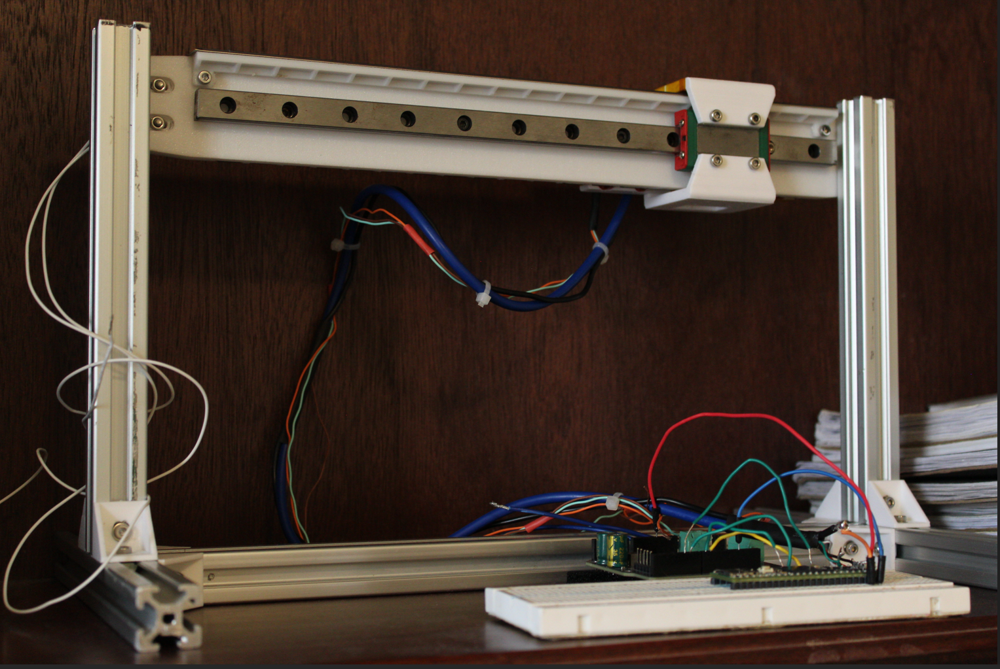
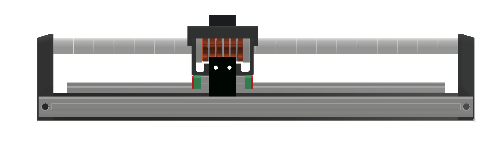

## Bluefin: Linear Motors for 3D printers


## Overview
This project focuses on setting up the infrastructure for the adoption of linear synchronous motors (LSMs) for 3D printing—especially large-format applications. The design methodology is to use [Blueshark: FEA](https://github.com/wgbowley/BlueShark) to automatically explore the design space, identify promising motors, and then verify them with a high-fidelity solver.

### Objectives
- Basic design must be 3D-printable using standard materials  
- Target force output: **20–30 N** with ripple force of ±5%  
- Options for passive or active cooling  
- Custom implementation of Klipper for closed-loop LSM  
- Establish a universal/standard interface for all LSMs  
- Custom driver board using field-oriented control (FOC)  
  - Option for step/dir input  
- Standardized parameter file for LSMs to allow easy sharing of projects  

---

## Prototype 0: Flat LSM (FLSM)


Prototype 0 had a force output of ~0.5 N with ~20 W input power. This first prototype showed poor force output and efficiency due to:

1. **Architecture mismatch**  
   Flat LSMs can achieve high precision (commercially proven), but they rely on laminated silicon steel armatures. Using laminated armatures would break the project objectives, so a new architecture must be explored.  
   > This path may still be revisited; documentation is in [/flat_lsm](/motors/flat_lsm/).

2. **Thermal mismanagement**  
   Thermal analysis wasn’t integrated into Blueshark during design. As a result, coil forms melted, creating friction between the armature and track. Future work must integrate thermal analysis directly into the optimization pipeline.

3. **High phase resistance**  
   The assumption that `0.21 mm` copper wire would suffice proved false. Future iterations should perform parameter sweeps of wire sizes during optimization.

Even with speculative improvements (e.g., increasing force-per-watt to **0.05 N/W**), it would take ~400 W to reach the force target. For an XY-coordinate 3D printer, it would require 2 motors at 800 W, which makes this architecture rather impractical for hobbyists.

---

## Current Development: Tubular LSM (TLSM)


>This design is directly based on work done by cmore839 in [DIY Linear Motor](https://github.com/cmore839/DIY-Linear-Motor)

Simulation results indicate this motor can achieve **~23.6 N** with ripple force of ±3.5%. These results come from a magnetics-only DEAP optimization script. Before prototyping:  

- Passive thermal analysis will be performed  
- If needed, an active cooling assembly will be designed and then validated using Autodesk CFD

### Blueshark v1.2-dev + DEAP: Candidate Motor Parameters
```json
{
    "Slot thickness": 7.808841637005781,
    "Slot axial length": 6.282677823549378,
    "Slot axial spacing": 1.2,
    "Wire diameter": 0.4,
    "status": "completed",
    "fitness": {
        "Average Force (N)": 23.665705333333335,
        "Force Per Watt (N/W)": 0.23847930884925927,
        "Peak-to-Peak Ripple (N)": 1.625355,
        "Inductance (H)": 0.002088156862745098,
        "Resistance (Ohms)": 4.134828405520234,
        "Time Constant (S)": 0.0005050165709312842
    }
}
```
Raw data: [/blueshark1.2+DEAP.json](/motors/tubular_lsm/blueshark1.2+DEAP.json).
>⚠️ Note: These results are likely optimistic. DEAP maximized coil size, which boosts winding count and force but does not account for thermal limits. Once Blueshark release + DEAP incorporates thermal objectives, slot sizes are expected to shrink, producing more realistic results.
